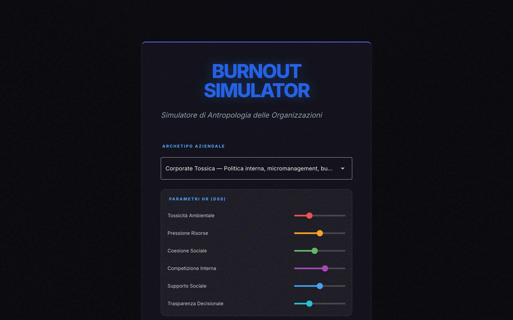
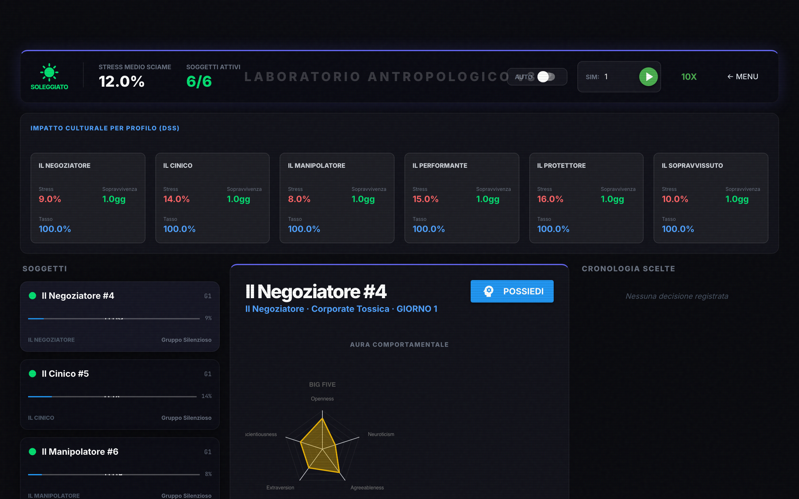
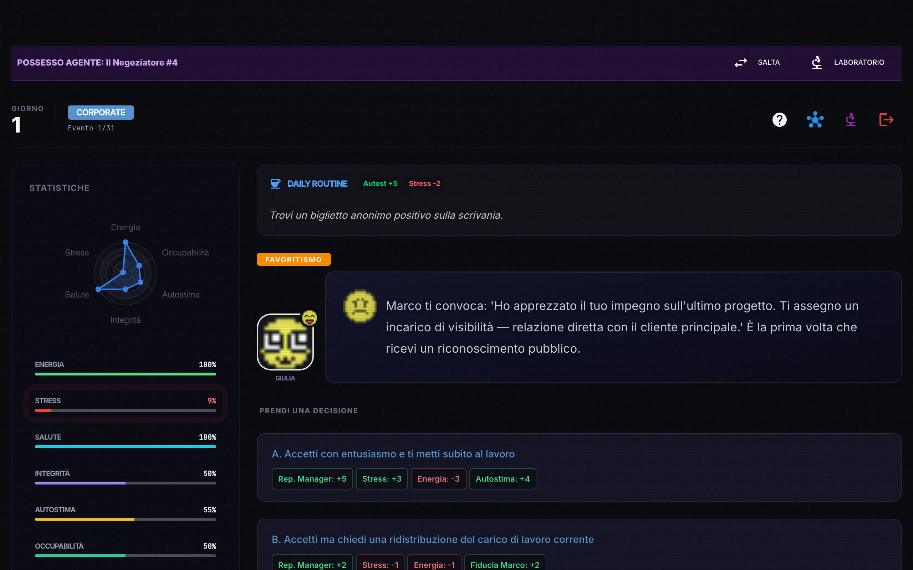
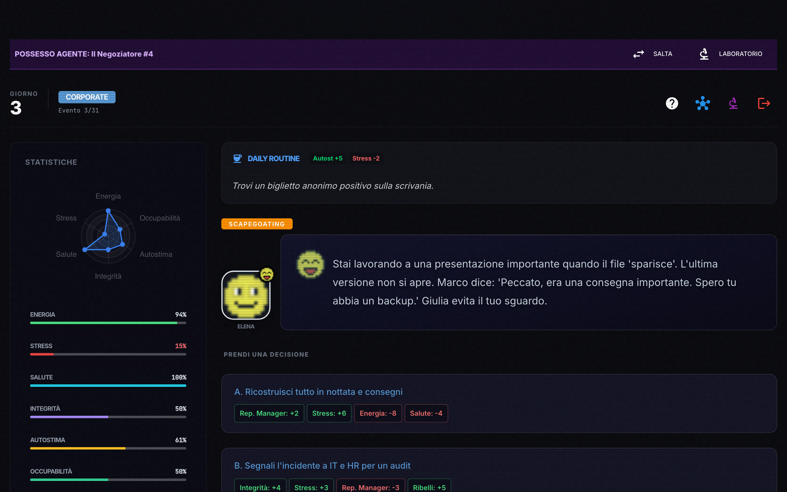
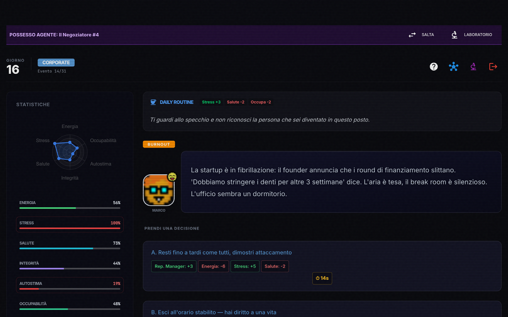
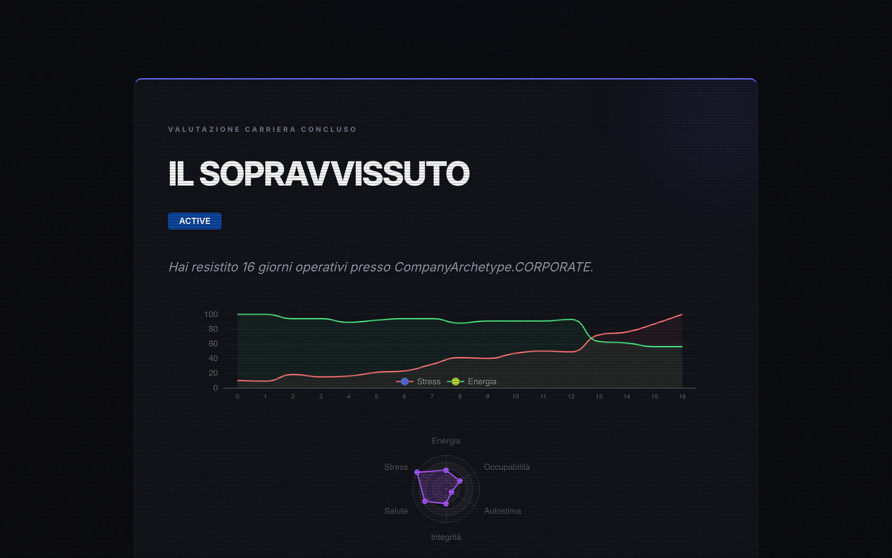
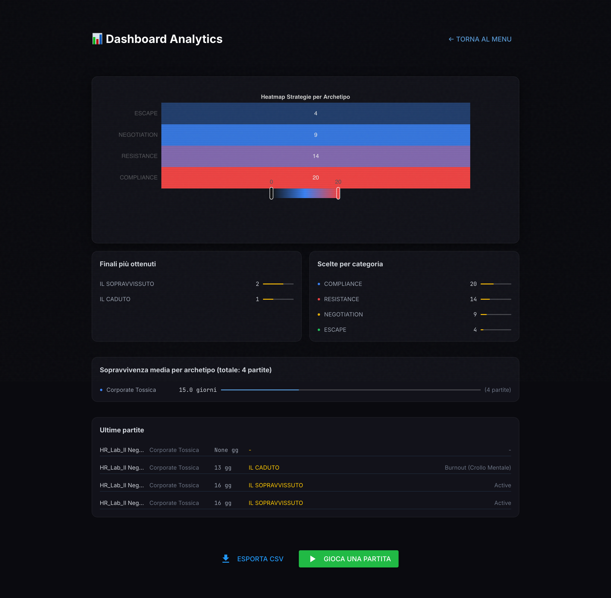

# Burnout Simulator v3.2 — Demo Interattiva

Benvenuto nella demo interattiva di **Burnout Simulator**, un simulatore di antropologia delle organizzazioni che modella le dinamiche tossiche, le strategie di sopravvivenza e l'evoluzione psicologica degli agenti in contesti aziendali.

Questa demo documenta una simulazione completa di **4 partite** da **15 giorni ciascuna**, per un totale di **47 scelte** registrate nel database analytics. Il flusso copre tutte le fasi: configurazione iniziale, Laboratorio Antropologico, possesso di agenti, scelte in-game, Game Over e Dashboard Analytics finale.

---

## 1. Schermata di Avvio (Start Screen)

La schermata iniziale presenta:
- **Selettore dell'Archetipo Aziendale**: Corporate Tossica, Startup Caotica, Azienda Familiare, Consulting
- **Parametri HR (DSS)**: Tossicità Ambientale, Pressione Risorse, Coesione Sociale, Competizione Interna, Supporto Sociale, Trasparenza Decisionale
- **Modalità "Casi Reali"**: eventi ispirati a storie vere
- **Opzione Salta Tutorial**
- **Pulsante "ENTRA NEL LABORATORIO"**: porta al Laboratorio Antropologico

In basso: link rapidi a Analytics, Editor eventi, Help, Config, e selettore lingua IT/EN.

---

## 2. Laboratorio Antropologico

Il **Laboratorio Antropologico v3.2** è il cuore della simulazione a sciame. Mostra:
- **Emotional Weather**: indicatore dello stress medio dello sciame (soleggiato, nuvoloso, temporale, tempesta, collasso)
- **Stress Medio Sciame** e **Soggetti Attivi**
- **Pannello AUTO**: simulazione automatica con contatore passi
- **Pulsante "← MENU"**: ritorno alla schermata iniziale

La schermata è organizzata in tre colonne:
- **SINISTRA**: elenco dei soggetti (agenti) con stress bar, profilo e fazione dominante
- **CENTRO**: focus sull'agente selezionato con radar OCEAN + Triade Oscura, evento corrente, scelte e probabilità, analisi strategica
- **DESTRA**: cronologia delle scelte con impact indicator

---

## 3. Possesso Agente — Schermata di Gioco

Dopo aver cliccato **"POSSIEDI"** su un agente, si entra nella schermata di gioco vera e propria:
- **Header**: giorno corrente, badge dell'archetipo aziendale, contatore eventi
- **Barra superiore**: pulsanti Help, Grafo Decisionale, Laboratorio, Esci (logout per terminare)
- **Sidebar sinistra**: radar psicologico, barre delle statistiche (Energia, Stress, Salute, Integrità, Autostima, Occupabilità), fazioni, relazioni NPC, ultime scelte, fase di carriera, stato di rischio
- **Area centrale**: evento narrativo con badge della categoria, ritratto NPC, testo dell'evento, e pulsanti di scelta con effetti visibili

Le scelte mostrano gli effetti direttamente nel bottone (es. "A. Ignora e continua a lavorare" → Salute: -20, Energia: -10, Stress: +10).

---

## 4. Feedback della Scelta

Dopo aver fatto una scelta, appare un **dialog modale "CONSEGUENZE"** che mostra il delta delle statistiche modificate dalla decisione presa:
- Variazioni positive in verde, negative in rosso
- Categoria della scelta (COMPLIANCE, RESISTANCE, NEGOTIATION, ESCAPE)
- Pulsante **"PROSEGUI"** per avanzare al turno successivo

---

## 5. Avanzamento Partita

Dopo alcuni turni di gioco, lo stato dell'agente evolve:
- Le statistiche si modificano in base alle scelte cumulative
- Gli eventi si susseguono con nuovi NPC e scenari
- La barra di stress e gli indicatori di rischio si aggiornano dinamicamente

Nella simulazione demo, ogni partita dura **15 turni**, con l'agente che accumula stress, energia e impatti sulle relazioni ad ogni scelta. Al termine, la partita viene conclusa manualmente tramite il pulsante di uscita per procedere alla schermata di valutazione.

---

## 6. Game Over — Valutazione Carriera

Quando la partita termina (per burnout, licenziamento, dimissioni o altro), viene mostrata la schermata di **Valutazione Carriera Conclusa**:
- **Finale**: titolo descrittivo del percorso
- **Badge di Stato**: Burnout, Licenziato, etc.
- **Giorni sopravvissuti** e tipo di azienda
- **Grafico Stress/Energia**: timeline dell'andamento psicologico
- **Radar finale**: profilo statistico a 6 dimensioni
- **Barre delle statistiche**: Energia, Stress, Salute, Integrità
- **Profilo Comportamentale**: distribuzione percentuale dei tag comportamentali
- **Analisi Antropologica**: commento discorsivo sulle tendenze emerse
- **Pulsanti**: "Gioca Ancora", "Esporta Report", "Grafo Decisionale"

---

## 7. Dashboard Analytics

La **Dashboard Analytics** mostra i dati aggregati di **tutte e 4 le partite** (47 scelte totali, ~15 giorni ciascuna):
- **Heatmap Strategie per Archetipo**: distribuzione delle scelte (COMPLIANCE, RESISTANCE, NEGOTIATION, ESCAPE) per tipo di azienda. In questa simulazione: 20 COMPLIANCE, 14 RESISTANCE, 9 NEGOTIATION, 4 ESCAPE su Corporate Tossica.
- **Finali più ottenuti**: classifica dei finali con barra proporzionale (IL SOPRAVVISSUTO, IL CADUTO, etc.)
- **Scelte per Categoria**: distribuzione delle scelte per categoria strategica
- **Sopravvivenza Media per Archetipo**: giorni medi (13-16gg) per archetipo aziendale
- **Ultime Partite**: tabella delle 4 sessioni recenti con nome agente, archetipo, giorni e finale
- **Pulsanti**: "Esporta CSV", "Gioca una partita", "← Torna al Menu"

---

## Tecnologie Utilizzate

| Componente | Tecnologia |
|---|---|
| Framework UI | **NiceGUI** (Python) |
| Database | **SQLite** (analytics + agent DB) |
| Grafici | **ECharts** (radar, linee, heatmap) |
| Automazione Screenshot | **Playwright** (Python) |
| Pattern Architetturale | **State Machine + Event-Driven** |

## Ringraziamenti

Burnout Simulator è un progetto di antropologia digitale applicata alle organizzazioni, con licenza **CC BY-NC-SA 4.0**.

---

*Documento generato il 6 Luglio 2026 — `4 partite × 15 giorni` = 47 scelte totali*
